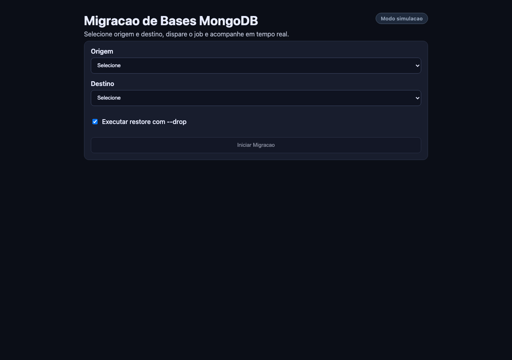
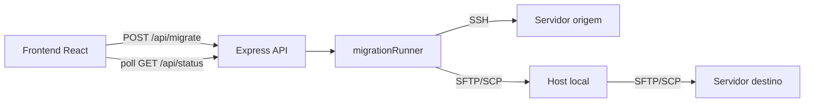

# db-tools — Migracao de Bases MongoDB

Plataforma web para orquestrar migracoes de bases MongoDB entre servidores remotos via SSH. A interface permite selecionar origem e destino, disparar o job de migracao e acompanhar o progresso em tempo real.



## Funcionalidades

- Selecao de servidores de origem e destino via interface web
- Orquestracao completa: `mongodump` → compressao → transferencia → `mongorestore`
- Opcao de restore com `--drop`, com backup pre-drop no destino
- Validacao de senha sudo no servidor destino antes da execucao
- Acompanhamento de progresso por polling (status, mensagem, barra de progresso)
- Modo simulacao (`DRY_RUN=true`) para testar o fluxo sem SSH real

## Arquitetura



### Estrutura do projeto

```
db-tools/
├── backend/          # API Express + orquestrador de migracao
│   └── src/
│       ├── config/   # Configuracao de servidores (local gitignored)
│       └── services/ # Jobs e execucao da migracao
├── frontend/         # UI React (Vite)
└── docs/             # Documentacao e screenshots
```

## Pre-requisitos

- Node.js 20+
- Acesso SSH aos servidores de origem e destino
- `mongodump`, `mongorestore` e `mongosh`/`mongo` instalados nos servidores remotos
- Chaves SSH configuradas (via `KEYS_DIR` ou agent)

## Quick start

```bash
# Instalar dependencias
npm run install:all

# Configurar ambiente
cp backend/.env.example backend/.env
cp backend/src/config/servers.example.js backend/src/config/servers.local.js
cp frontend/.env.example frontend/.env

# Edite servers.local.js com seus servidores reais

# Terminal 1 — backend (modo simulacao por padrao)
npm run dev:backend

# Terminal 2 — frontend
npm run dev:frontend
```

Acesse `http://localhost:5173`. O badge **Modo simulacao** indica que nenhuma operacao SSH real sera executada.

## Configuracao

### Variaveis de ambiente (backend)

| Variavel | Padrao | Descricao |
|----------|--------|-----------|
| `PORT` | `4000` | Porta da API |
| `DRY_RUN` | `true` | `true` simula o fluxo; `false` executa SSH real |
| `KEYS_DIR` | `/var/keys` | Diretorio com arquivos `.pem` |
| `SERVERS_CONFIG_PATH` | `./src/config/servers.local.js` | Caminho para config de servidores |

### Variaveis de ambiente (frontend)

| Variavel | Padrao | Descricao |
|----------|--------|-----------|
| `VITE_API_BASE_URL` | `http://localhost:4000` | URL base da API |

### Estrutura de um servidor

```javascript
STAGING_A: {
  name: "staging-a",              // Nome exibido no banco destino
  login: "staging-a",             // Identificador de login/tenant
  nickname: "Staging A",          // Apelido
  ip: "10.0.0.10",                // IP ou hostname
  user: "deploy",                 // Usuario SSH
  key: "example-key.pem",         // Arquivo em KEYS_DIR (opcional se usar agent)
  path: "/home/deploy/db/myapp",  // Diretorio de trabalho remoto
  database: "myapp",              // Nome do banco MongoDB
  metadataCollection: "app_metadata",  // Collection de metadados (opcional, so destino)
  restartCommand: "systemctl restart myapp",  // Opcional, usado com --drop
}
```

Servidores de origem e destino sao definidos separadamente em `SOURCE_SERVERS` e `TARGET_SERVERS` no arquivo de config local.

### Execucao real

1. Copie `servers.example.js` para `servers.local.js` e preencha com dados reais
2. Coloque as chaves SSH em `KEYS_DIR`
3. Defina `DRY_RUN=false` no `backend/.env`
4. Reinicie o backend

## API

| Metodo | Endpoint | Descricao |
|--------|----------|-----------|
| `GET` | `/api/health` | Health check (`mode`: `dry-run` ou `live`) |
| `GET` | `/api/servers` | Lista servidores de origem e destino |
| `POST` | `/api/migrate` | Inicia job de migracao |
| `GET` | `/api/status/:jobId` | Consulta status do job |

### Exemplo: iniciar migracao

```bash
curl -X POST http://localhost:4000/api/migrate \
  -H "Content-Type: application/json" \
  -d '{
    "origin": "STAGING_A",
    "destination": "DEMO_A",
    "flags": { "drop": true },
    "sudoPassword": "sua-senha-sudo"
  }'
```

Resposta:

```json
{ "jobId": "uuid-do-job", "status": "started" }
```

### Exemplo: consultar status

```bash
curl http://localhost:4000/api/status/uuid-do-job
```

## Seguranca

> **Atencao:** esta ferramenta foi projetada para uso interno em redes confiaveis.

- A senha sudo e enviada na requisicao HTTP — **nao exponha a API publicamente** sem autenticacao
- Jobs sao armazenados em memoria (perdidos ao reiniciar o backend)
- Chaves SSH e configs de servidores devem permanecer fora do repositorio (`servers.local.js`, `.env`)
- Use `DRY_RUN=true` para validar integracoes antes de operacoes reais

## Scripts disponiveis

| Comando | Descricao |
|---------|-----------|
| `npm run install:all` | Instala dependencias do backend e frontend |
| `npm run dev:backend` | Inicia API em modo desenvolvimento |
| `npm run dev:frontend` | Inicia UI em modo desenvolvimento |
| `npm run build` | Build de producao do frontend |
| `npm run lint` | Lint do frontend |

## Licenca

[MIT](LICENSE)
